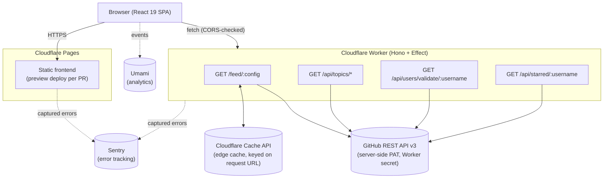
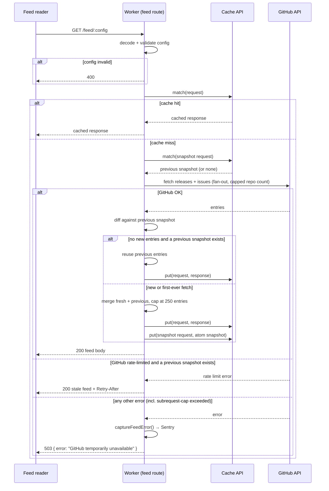
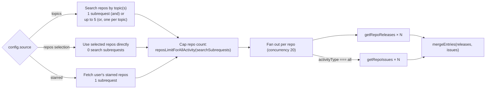
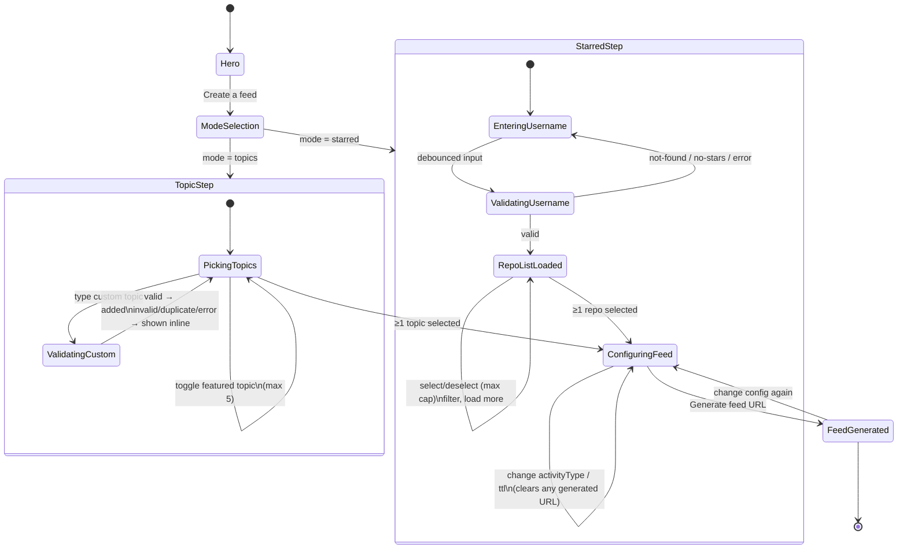

# Architecture

No origin server, no database, no session state. The Worker is the entire
backend; the Cloudflare Cache API is the only persistence layer.

## System overview

`/feed/*` is unauthenticated and CORS-free (it's consumed by feed readers, not
the browser's `fetch`). `/api/*` remains publicly accessible, but it is
CORS-enabled only for an origin allow-list (the production domains plus the
`*.ossreleasefeed.pages.dev` preview-deploy pattern) so only those browser
origins receive readable cross-origin responses — see `worker/src/index.ts`.

## Feed request flow

What happens on `GET /feed/:config`, including the cache/diff/fallback logic
in `worker/src/routes/feed.ts`:

Two response caches are kept per config: the outward-facing one (in the
requested format/TTL) and a 7-day atom "snapshot" used purely to diff against
on the next fetch, independent of the caller's cache TTL.

## GitHub subrequest budget

`generateFeedEntries` (`worker/src/feed/generate.ts`) fans out release and
issue fetches per repo, concurrency-capped, and caps the repo count so the
total subrequest count stays under the Workers free plan's 50-subrequest
ceiling:

A single repo's failure (404, network error, parse error) resolves to an
empty entry list rather than aborting the whole feed — only a GitHub
rate-limit error propagates, since that's the one case `feed.ts` can recover
from with a stale-cache fallback.

## Feed builder UI flow

The frontend's guided flow, from landing to a generated feed URL
(`frontend/src/components/Builder.tsx` and its steps):

Both steps use the same `FeedConfigPanel` for the final activity-type/TTL
choice and URL generation; changing any upstream selection clears a
previously generated URL so it can't silently go stale in the UI.

## What's out of scope

No auth, no database, no server-rendered pages, no queues/durable objects.
The Worker is stateless per request beyond the two Cache API entries per
feed config.
