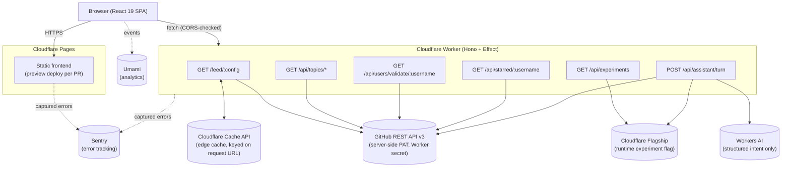
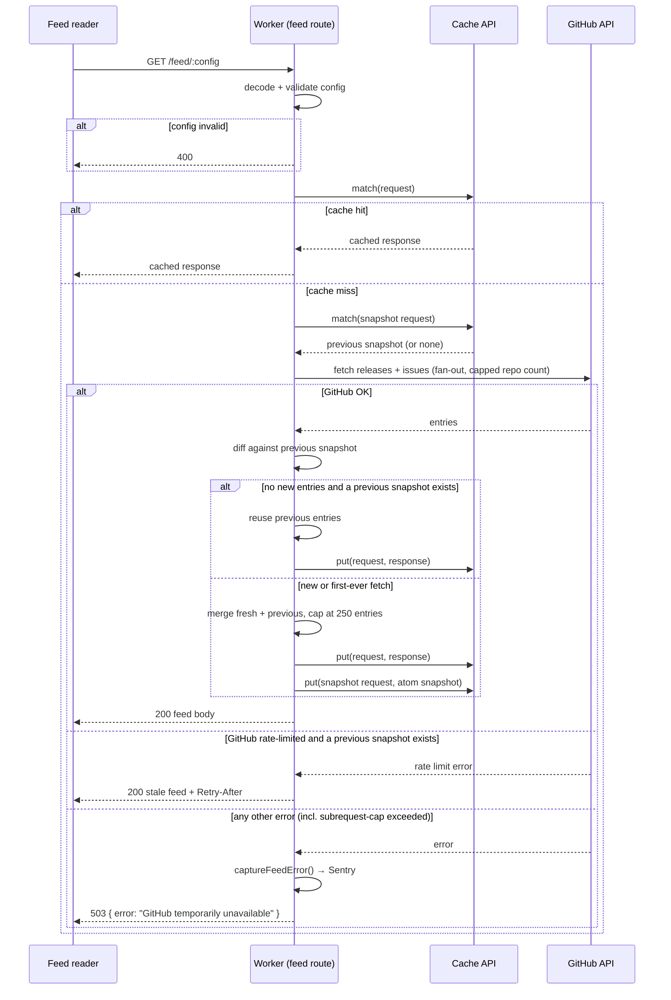
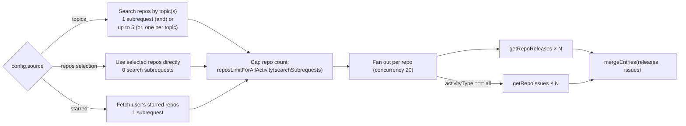
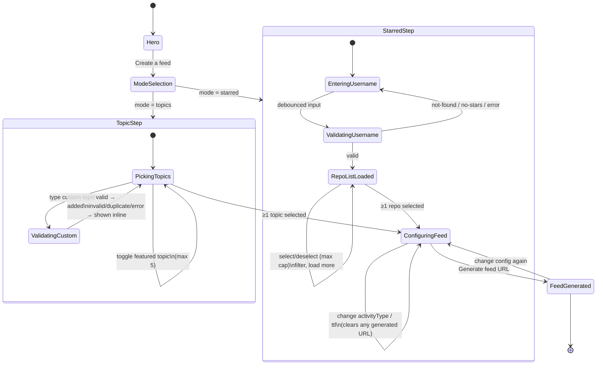
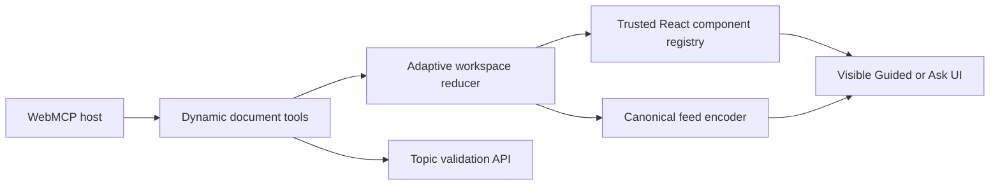

# Architecture

No origin server, no database, no session state. The Worker is the entire
backend; the Cloudflare Cache API is the only persistence layer.

## System overview

```mermaid
flowchart TD
    Browser["Browser (React 19 SPA)"]

    subgraph Pages["Cloudflare Pages"]
        SPA["Static frontend\n(preview deploy per PR)"]
    end

    subgraph Worker["Cloudflare Worker (Hono + Effect)"]
        Feed["GET /feed/:config"]
        Topics["GET /api/topics/*"]
        Users["GET /api/users/validate/:username"]
        Starred["GET /api/starred/:username"]
        Experiments["GET /api/experiments"]
        Assistant["POST /api/assistant/turn"]
    end

    Cache[("Cloudflare Cache API\n(edge cache, keyed on request URL)")]
    GitHub[("GitHub REST API v3\n(server-side PAT, Worker secret)")]
    Sentry[("Sentry\n(error tracking)")]
    Umami[("Umami\n(analytics)")]
    Flagship[("Cloudflare Flagship\n(runtime experiment flag)")]
    WorkersAI[("Workers AI\n(structured intent only)")]

    Browser -- HTTPS --> SPA
    Browser -- "fetch (CORS-checked)" --> Worker
    Browser -. events .-> Umami

    Feed <--> Cache
    Feed --> GitHub
    Topics --> GitHub
    Users --> GitHub
    Starred --> GitHub
    Experiments --> Flagship
    Assistant --> Flagship
    Assistant --> WorkersAI
    Assistant --> GitHub

    Worker -. captured errors .-> Sentry
    SPA -. captured errors .-> Sentry
```

`/feed/*` is unauthenticated and CORS-free (it's consumed by feed readers, not
the browser's `fetch`). `/api/*` remains publicly accessible, but it is
CORS-enabled only for an origin allow-list (the production domains plus the
`*.ossreleasefeed.pages.dev` preview-deploy pattern) so only those browser
origins receive readable cross-origin responses — see `worker/src/index.ts`.

## Feed request flow

What happens on `GET /feed/:config`, including the cache/diff/fallback logic
in `worker/src/routes/feed.ts`:

```mermaid
sequenceDiagram
    participant R as Feed reader
    participant W as Worker (feed route)
    participant C as Cache API
    participant G as GitHub API

    R->>W: GET /feed/:config
    W->>W: decode + validate config
    alt config invalid
        W-->>R: 400
    end

    W->>C: match(request)
    alt cache hit
        C-->>W: cached response
        W-->>R: cached response
    else cache miss
        W->>C: match(snapshot request)
        C-->>W: previous snapshot (or none)

        W->>G: fetch releases + issues (fan-out, capped repo count)
        alt GitHub OK
            G-->>W: entries
            W->>W: diff against previous snapshot
            alt no new entries and a previous snapshot exists
                W->>W: reuse previous entries
                W->>C: put(request, response)
            else new or first-ever fetch
                W->>W: merge fresh + previous, cap at 250 entries
                W->>C: put(request, response)
                W->>C: put(snapshot request, atom snapshot)
            end
            W-->>R: 200 feed body
        else GitHub rate-limited and a previous snapshot exists
            G-->>W: rate limit error
            W-->>R: 200 stale feed + Retry-After
        else any other error (incl. subrequest-cap exceeded)
            G-->>W: error
            W->>W: captureFeedError() → Sentry
            W-->>R: 503 { error: "GitHub temporarily unavailable" }
        end
    end
```

Two response caches are kept per config: the outward-facing one (in the
requested format/TTL) and a 7-day atom "snapshot" used purely to diff against
on the next fetch, independent of the caller's cache TTL.

## GitHub subrequest budget

`generateFeedEntries` (`worker/src/feed/generate.ts`) fans out release and
issue fetches per repo, concurrency-capped, and caps the repo count so the
total subrequest count stays under the Workers free plan's 50-subrequest
ceiling:

```mermaid
flowchart LR
    Config{"config.source"}
    Config -->|topics| Search["Search repos by topic(s)\n1 subrequest (and) or\nup to 5 (or, one per topic)"]
    Config -->|repos selection| Selected["Use selected repos directly\n0 search subrequests"]
    Config -->|starred| Starred["Fetch user's starred repos\n1 subrequest"]

    Search --> Cap["Cap repo count:\nreposLimitForAllActivity(searchSubrequests)"]
    Selected --> Cap
    Starred --> Cap

    Cap --> FanOut["Fan out per repo (concurrency 20)"]
    FanOut --> Releases["getRepoReleases × N"]
    FanOut -->|"activityType === all"| Issues["getRepoIssues × N"]
    Releases --> Merge["mergeEntries(releases, issues)"]
    Issues --> Merge
```

A single repo's failure (404, network error, parse error) resolves to an
empty entry list rather than aborting the whole feed — only a GitHub
rate-limit error propagates, since that's the one case `feed.ts` can recover
from with a stale-cache fallback.

## Feed builder UI flow

The frontend's guided flow, from landing to a generated feed URL
(`frontend/src/components/Builder.tsx` and its steps):

```mermaid
stateDiagram-v2
    [*] --> Hero
    Hero --> ModeSelection: Create a feed
    ModeSelection --> TopicStep: mode = topics
    ModeSelection --> StarredStep: mode = starred

    state TopicStep {
        [*] --> PickingTopics
        PickingTopics --> PickingTopics: toggle featured topic\n(max 5)
        PickingTopics --> ValidatingCustom: type custom topic
        ValidatingCustom --> PickingTopics: valid → added\ninvalid/duplicate/error → shown inline
        PickingTopics --> ConfiguringFeed: ≥1 topic selected
    }

    state StarredStep {
        [*] --> EnteringUsername
        EnteringUsername --> ValidatingUsername: debounced input
        ValidatingUsername --> EnteringUsername: not-found / no-stars / error
        ValidatingUsername --> RepoListLoaded: valid
        RepoListLoaded --> RepoListLoaded: select/deselect (max cap)\nfilter, load more
        RepoListLoaded --> ConfiguringFeed: ≥1 repo selected
    }

    ConfiguringFeed --> ConfiguringFeed: change activityType / ttl\n(clears any generated URL)
    ConfiguringFeed --> FeedGenerated: Generate feed URL
    FeedGenerated --> ConfiguringFeed: change config again
    FeedGenerated --> [*]
```

Both steps use the same `FeedConfigPanel` for the final activity-type/TTL
choice and URL generation; changing any upstream selection clears a
previously generated URL so it can't silently go stale in the UI.

## Adaptive feed experiment (Phase 3)

The `adaptive-feed-builder` Flagship flag defaults to `false` and currently
serves `true` only when the trusted request surface is `local` or `preview`.
The homepage fetches `GET /api/experiments` with a stable anonymous key. When
enabled, a user can choose the unchanged Guided flow or use a multi-turn typed
builder backed by `POST /api/assistant/turn` for both topic and
starred-repository feeds.

The browser first persists the anonymous key in local storage, then falls back
to session storage. It also retains the key in module memory, so every turn in
the current page uses the same key even when browser storage is unavailable.
If both storage mechanisms are blocked, a full page reload creates a new key;
the separate network rate limit remains the anti-rotation ceiling.

Cloudflare Pages preview URLs are public to anyone who has the URL; a preview
is not an authentication boundary. Before any model invocation, the Worker
therefore applies both a five-request-per-60-seconds anonymous-client limit and
a shared 15-request-per-60-seconds network limit. Rotating the anonymous key
does not bypass the network ceiling. Cloudflare's rate-limit binding reports an
allow/deny decision, not the number of requests remaining, so the UI describes
the policy rather than showing an inaccurate quota counter. A rejected request
returns `Retry-After`, which the UI uses for exact retry guidance. Preview
access should still be treated as public and temporary, not private testing.

The assistant endpoint checks the same flag and two independent rate limits
before invoking Workers AI. The model is a constrained semantic parser: it can
return only an intent, fields explicitly changed by the current message, an
optional positional repository-selection action, and a categorical unsupported
reason. It cannot propose workflow state, UI, product copy, markup, or a URL.
Worker code rejects unknown and contradictory fields, applies the patch,
validates every GitHub entity, derives the next required decision and visible
state, and encodes the feed URL itself. Missing bindings and inference errors
fail closed; disabling the flag makes new assistant turns return `404`.

The Worker sends the model only the current message and the authoritative
draft, issues, interval-selection flag, and application-derived required
decision. The locally retained transcript is presentation state and is not
trusted or forwarded to the model. Informational intents must contain an empty
patch and no repository action, so capability and list questions cannot mutate
the feed. Source inference ignores neutral optional values such as
`topics: []` and `username: null`, preventing structured-output defaults from
silently switching branches.

The browser and Worker share semantic state/draft invariants for source choice,
topic editing, username entry, repository choice, settings editing, ready, and
recovery. Application code derives editable state from the discriminated draft;
the model does not participate in transitions. A repository subset is complete
only when it contains at least one unique repository—an empty subset is rejected
rather than falling through to the distinct “all starred repositories”
configuration. Capability questions, corrections, invalid entities, and
unsupported intervals therefore all pass through one deterministic planner and
validation boundary.

Starred-repository turns validate the username format, its existence, and its
public starred count through GitHub before any repository work. An explicit
“all” request builds the feed URL with a `null` repository list (the feed
generator fetches and caps the starred set at generation time); a named subset
is checked against the user's fetched public starred repositories and the
invalid names are reported as issues. The 25-repository cap, no-user,
no-stars, and GitHub-error behavior match the Guided flow, and activity and
update-frequency changes work through conversation or the revealed settings
panel in the repository-choice state.

Informational turns remain conversational. Feed-type questions return a short
text explanation, and topic-discovery questions use the current featured-topic
service to provide examples without revealing controls. The exact, narrow
`show ui` and `hide ui` commands are handled before request-rate accounting and
inference; more varied visibility requests still use the model's `show-ui` or
`hide-ui` intent. Each path calls its corresponding deterministic visibility
planner. For a configured topic feed, showing the UI reveals topic and settings
controls; for a configured starred feed it reveals username, repository, and
settings controls. Hiding those controls preserves a completed feed and its
generated URL as application state while removing the panel from view. The
model still cannot name components, generate markup, or bypass validation.

Incomplete feed-building turns also remain conversational until the user asks
for controls. Each deterministic response confirms the validated change,
identifies the next decision, and offers either a textual list of supported
options or the relevant UI. For example, selecting topics advances the draft
to update-frequency selection without automatically revealing settings. The
stored one-hour value is a control default, not evidence that the user chose an
interval. A complete request that explicitly includes a supported interval can
still skip directly to the generated URL.

One reducer owns the complete `FeedDraft` used by Ask and Guided modes,
including the starred username and repository selection. The trusted component
registry maps application-derived state to source, topic, username, repository,
settings, issue, recipe, and URL components. Typed turns and clicks can be mixed
freely, and switching modes no longer creates a second starred draft. Generating
from Guided mode records the visible default interval as selected; any later
draft change clears the URL. Both the frontend and Worker use the same canonical
array ordering when encoding equivalent feed configurations.

Ask sessions are stored locally with a schema version and timestamp. Restore
rejects malformed or internally inconsistent state, expires after seven days,
and caps retained transcript context. The saved workspace includes the draft,
conversation, composer, selected interaction mode, and builder state. **Start
over** clears both the live workspace and its saved snapshot. The saved
workspace also records whether controls were intentionally revealed, so a
restored informational conversation does not unexpectedly expose UI.

The workspace also carries a monotonically increasing revision. An assistant
response is accepted only when the revision still matches the snapshot used to
start that request. Start over, a mode change, or any direct draft/composer edit
therefore makes a late response stale instead of letting it overwrite newer
work. Topic validation and starred-repository lookup completions likewise check
their abort signal and current input before committing results.

Manual mode changes keep both the Ask composer and a started Guided builder
mounted but hidden, preserving their shared validated state. The mode change
aborts any active Ask request. If the runtime flag is disabled, Ask mode is
removed, its saved session is cleared, and the user is moved to the already
available prefilled Guided baseline.

## WebMCP browser tool surface

On browsers that expose `document.modelContext`, the frontend progressively
registers a small WebMCP toolset over the same authoritative workspace used by
Guided and Ask modes. The first vertical slice supports topic feeds:

- `read-feed-workspace` is always available and returns a sanitized snapshot;
- `choose-feed-source` is always available and currently accepts `topics`;
- `set-topics` appears after the topic source is selected;
- `set-feed-settings` appears after at least one topic is validated; and
- `generate-feed-url` appears after an update frequency is explicitly chosen.

```mermaid
flowchart LR
    Host[WebMCP host] --> Tools[Dynamic document tools]
    Tools --> Reducer[Adaptive workspace reducer]
    Tools --> TopicAPI[Topic validation API]
    Reducer --> Registry[Trusted React component registry]
    Reducer --> Encoder[Canonical feed encoder]
    Registry --> VisibleUI[Visible Guided or Ask UI]
    Encoder --> VisibleUI
```

Tool schemas help the host form valid calls, while every handler also validates
inputs and current state at runtime. Topic validation is asynchronous and
revision-guarded, so a late result cannot overwrite newer user or agent edits.
Registration lifetimes use abort signals; when the workflow changes, the old
tool set is removed before the newly applicable tools become live. Tool
handlers re-check state at execution time in case a host retained a stale tool
reference.

WebMCP is a deterministic browser command surface, not a second assistant. It
does not call `POST /api/assistant/turn`, does not expose transcript, composer,
or experiment identifiers, and cannot provide model-generated UI or URLs.
Unsupported browsers receive no tools and retain the unchanged application
experience.

## What's out of scope

No auth, no database, no server-rendered pages, no queues/durable objects.
The Worker is stateless per request beyond the two Cache API entries per
feed config.
